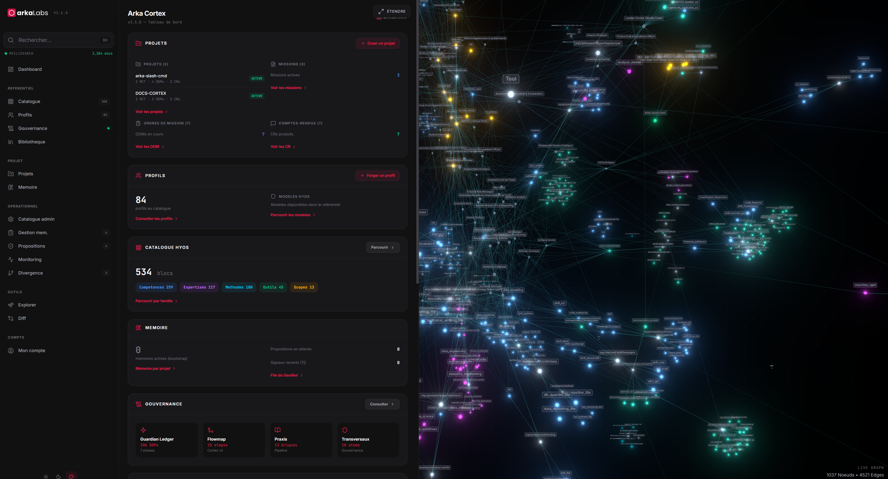
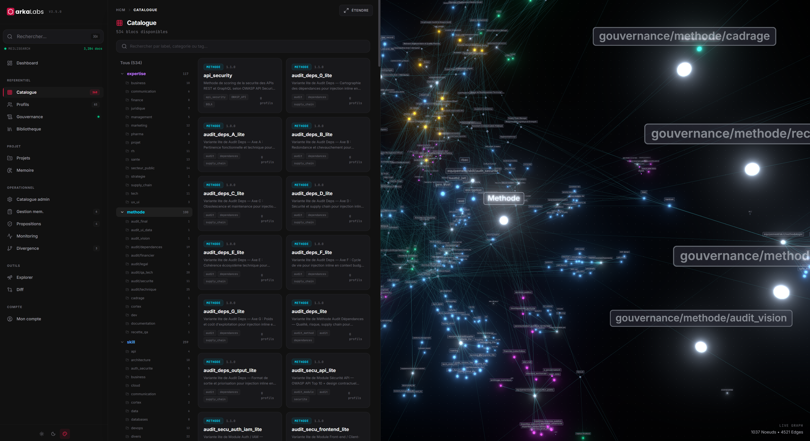
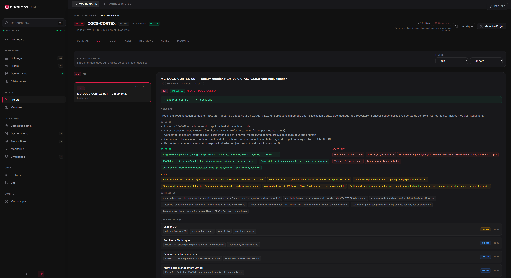
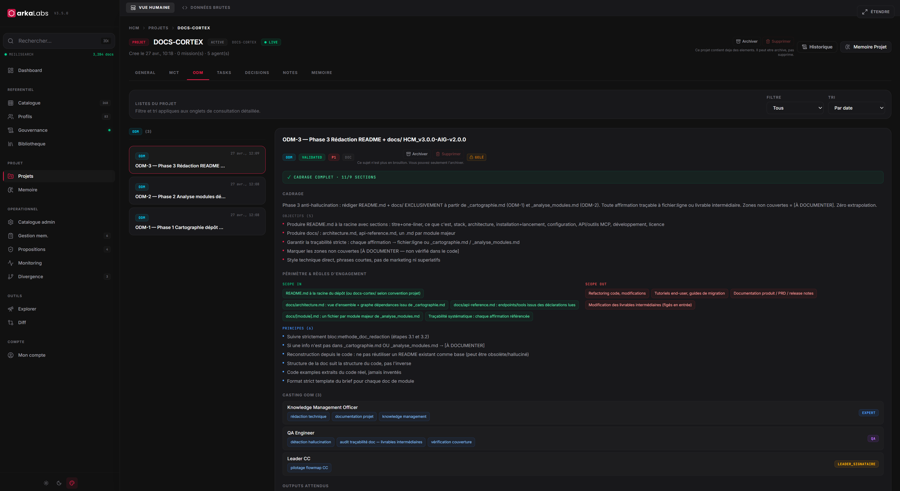
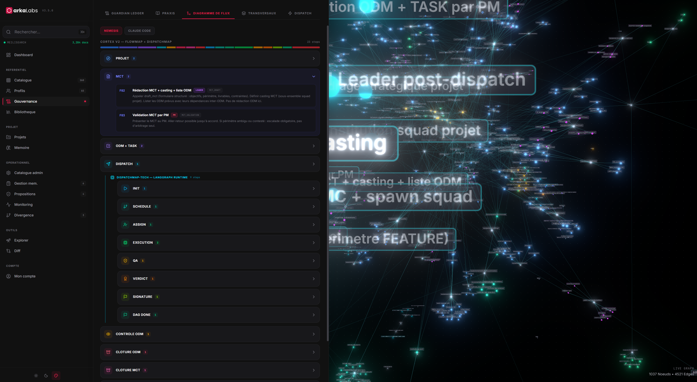
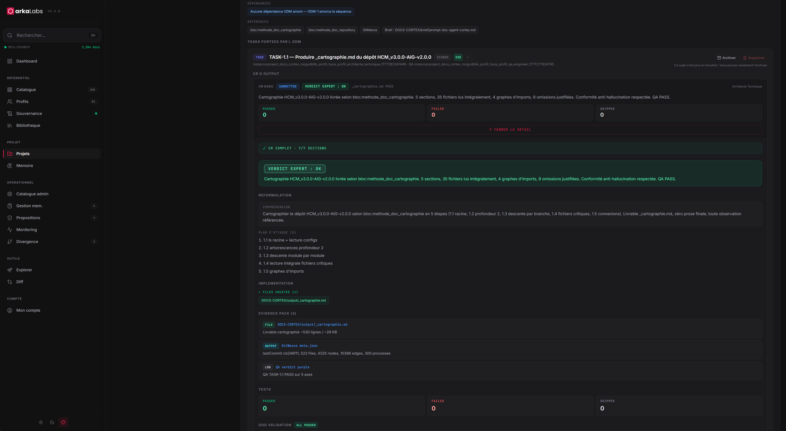
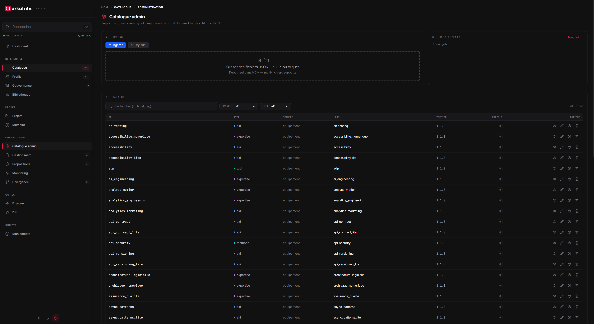

# Cortex — Mémoire Organisationnelle Augmentée

> **Status** : Beta v3.5.0 — Production active  
> **Stack** : SurrealDB + PostgreSQL + React 19 + Node.js 22 + MCP  
> **License** : MIT

---

## Vision

Cortex est une **plateforme de mémoire organisationnelle** qui permet aux équipes et aux agents LLM de collaborer sur du travail structuré en temps réel, avec gouvernance intégrée et traçabilité complète.

**Cas d'usage :**
- 📊 **Orchestration d'agents LLM** — coordination multi-agents sur missions complexes
- 🧠 **Mémoire partagée** — connaissance accumulée, patterns détectés, décisions documentées
- 🔐 **Gouvernance métier** — phases de validation, signatures en cascade, règles auditées
- 🔄 **Instanciation de projets** — snapshots versionnés, divergences mesurées, cross-pollination

---

## Démarrage rapide

### Option 1 : Voir la démo (interactive)

**Accédez à une instance de démonstration déployée :**
```
URL : https://cortex.arkalabs.app (ou instance privée fournie)
Email : demo@example.com
Mot de passe : (fourni par admin)
```

→ Explorez le **Dashboard**, les **Profils**, les **Projets**, la **Mémoire**.

### Option 2 : Installer localement

**Prérequis :**
- Docker + Docker Compose
- Node.js 22+
- 4GB RAM, 5GB disque

**Installation (5 min) :**
```bash
git clone https://github.com/arka-squad/cortex.git
cd cortex
docker-compose up -d

# Services démarrent sur :
# UI : http://localhost:80
# API : http://localhost:9096
# MCP : http://localhost:3001
```

**Premiers pas :**
1. Ouvrir http://localhost:80
2. Créer un compte (mode dev = auto-signup)
3. Créer un projet de test
4. Explorer le tableau de bord

---

## Galerie

### 📊 Dashboard
Vue synthétique des projets actifs, missions et statuts agents.



### 📁 Catalogue
Parcourez les blocs de connaissance (skills, expertises, outils, méthodes) — 268+ items indexés.



### 👥 Profils HYOS
Composez dynamiquement des profils à partir de blocs modulaires.


### 🗂️ Projets & Missions
Cycle de vie complet : Projet → Mission → ODM → Tâche avec gouvernance.




### 📋 ODM (Ordre de Mission)
Détail ODM avec assignations, priorités et statuts.



### 🎯 Gouvernance & Flowmaps
Visualisez phases, règles de signature et workflows en cascade.



### ✅ CR & QA
Comptes-rendus et Contrôle Qualité avec verdicts et workflows.



### ⚙️ Admin
Téléchargement de librairies et gestion des ressources.



---

## Architecture

```
┌─────────────────────────────────────────────────────────┐
│  Interfaces                                             │
│  • UI React 19 (http://localhost:80)                   │
│  • REST API (port 9096) — 234 endpoints                │
│  • MCP Server (port 3001) — ~89 outils pour LLM       │
├─────────────────────────────────────────────────────────┤
│  Services Domaine (31 services)                        │
│  • Gouvernance : validation, signatures, phases        │
│  • Mémoire : notes Praxis, checkpoints, patterns      │
│  • Versioning : snapshots, divergences                │
│  • Orchestration : spawn agents, workflows             │
├─────────────────────────────────────────────────────────┤
│  Stockage & IA                                          │
│  • SurrealDB v2.1.7 (graphe de connaissance)          │
│  • PostgreSQL 16 (documents, audit)                   │
│  • Meilisearch v1.12 (recherche full-text)            │
│  • Ollama local (embeddings bge-m3, LLM mistral)      │
│  • MinIO (stockage blob)                               │
└─────────────────────────────────────────────────────────┘
```

---

## Concepts clés

### Cycle de vie : Projet → Mission → Tâche

```
Projet (MC)
  ├─ Mission (ODM)
  │   ├─ Tâche (TASK)
  │   └─ Compte-Rendu (CR)
  └─ Gouvernance (phases, signatures)
```

### Profils HYOS — Assemblages dynamiques

Composez des **blocs modulaires** selon le contexte :
- 🎯 **Skills** : TDD, Kanban, RGPD, CI/CD
- 💼 **Expertises** : domaine métier
- 🛠️ **Tools** : React, Docker, PostgreSQL
- 📋 **Methods** : OWASP, audit RGPD
- 🔑 **Scopes** : permissions, modes

### Mémoire Structurée

Chaque agent accumule :
- 📝 **Notes Praxis** : blocages, clarifications, signaux faibles
- ✅ **Checkpoints** : verdicts, protocoles de résilience
- 🔄 **Patterns** : récurrences détectées automatiquement
- 🎯 **Décisions** : choix documentés

---

## Stack technique

| Composant | Tech | Port | Rôle |
|-----------|------|------|------|
| **Graphe de connaissance** | SurrealDB v2.1.7 | privé | Nœuds, arêtes, historique |
| **Documents & audit** | PostgreSQL 16 | privé | Artefacts, logs |
| **Recherche** | Meilisearch v1.12 | privé | Full-text indexing |
| **IA local** | Ollama + bge-m3 | privé | Embeddings sémantiques |
| **API REST** | Node.js 22 + Express 5 | **9096** | Logique métier |
| **MCP Server** | Node.js 22 + Express 5 | **3001** | Interface agents LLM |
| **UI** | React 19 + Vite | **80** | Interface utilisateur |

---

## Capacités principales

### Pour les humains
- ✅ **Tableau de bord** synthétique — projets, missions, statuts
- ✅ **Gouvernance visuelle** — phases, signatures, règles
- ✅ **Gestion de profils** — création, composition, assignation
- ✅ **Mémoire accessible** — recherche, historique, patterns
- ✅ **Explorer 3D** — navigation graphe de connaissance

### Pour les agents LLM
- ✅ **Workspace API** — créer/lire projets, missions, tâches
- ✅ **Memory API** — déposer notes, lire résumés
- ✅ **Governance API** — consulter phases, règles, templates
- ✅ **Catalogue API** — lister blocs, modèles
- ✅ **Search** — requêtes transversales sur le graphe
- ✅ **89 outils MCP** — interface standardisée

### Pour DevOps
- ✅ **234 endpoints REST** — API complète documentée
- ✅ **RBAC 4 niveaux** — admin, producteur, contributeur, lecteur
- ✅ **Audit complet** — traçabilité de chaque action
- ✅ **Webhooks temps réel** — SSE pour synchronisation
- ✅ **Docker Compose** — déploiement self-hosted

---

## Roadmap

### Q2 2026
- ✅ Workers autonomes (debrief, nlp_cleanup, reconciliation)
- 🔄 Activation embeddings bge-m3 en production

### Q3 2026
- 🤖 9 agents HCM auto-déployables
- 🌐 Cross-pollination automatique inter-projets

### Q4 2026+
- Intégration providers GenAI supplémentaires (OpenAI, Anthropic)
- Time-travel complet (git-like versioning)
- UI collaboration temps réel

---

## Documentation

- 📖 **[Guide complet](./docs/Cortex_arkalabs_v3.5.0_doc-v1.md)** — Architecture, API, concepts
- 🔌 **API OpenAPI** — Documentation automatique (en dev : `/api/docs`)
- 🎯 **Quickstart local** — Voir section "Démarrage rapide" ci-dessus
- 💬 **Support** — Issues sur ce repo ou canal Slack

---

## Community & Support

- **Issues & Discussions** → [GitHub Issues](https://github.com/arka-squad/cortex/issues)
- **Email** → support@arkalabs.app
- **Slack** → #cortex-users

---

## License

Licence Apache-2.0

---

**Prêt à essayer ?** 👉 **[Accédez à la démo](https://cortex.arkalabs.app)** ou installez localement (5 min).

Merci de nous accompagner ! 🚀
